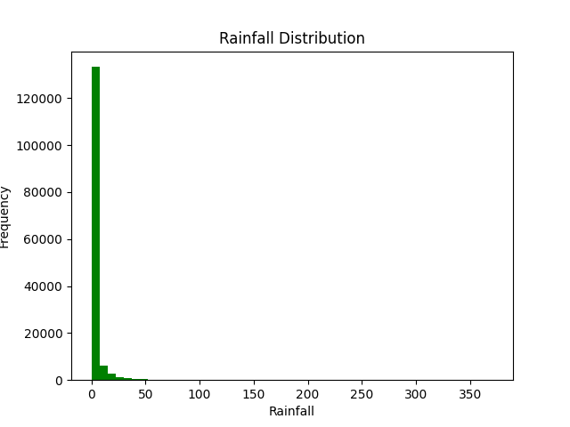
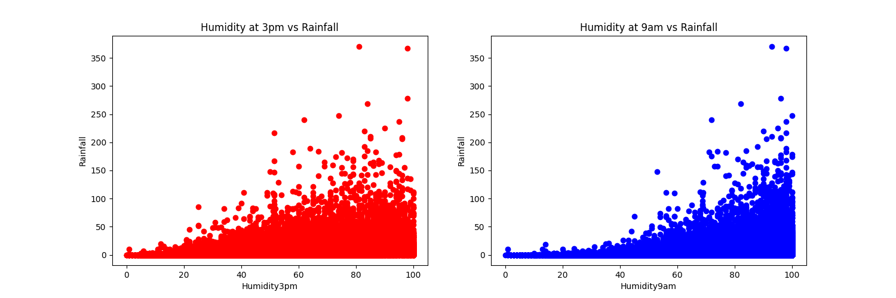
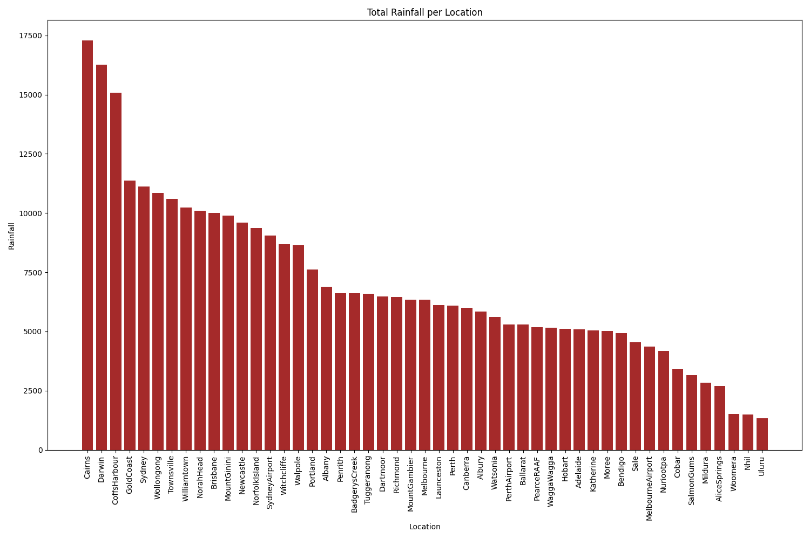
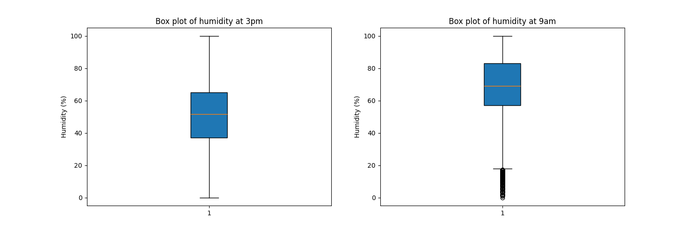
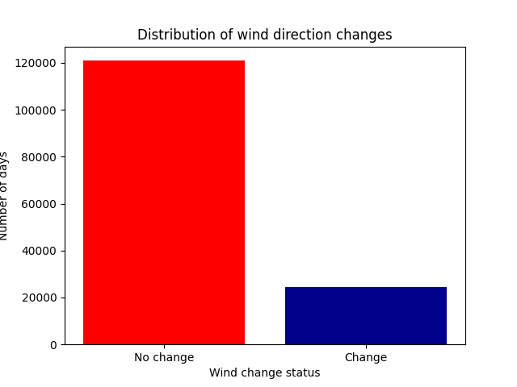
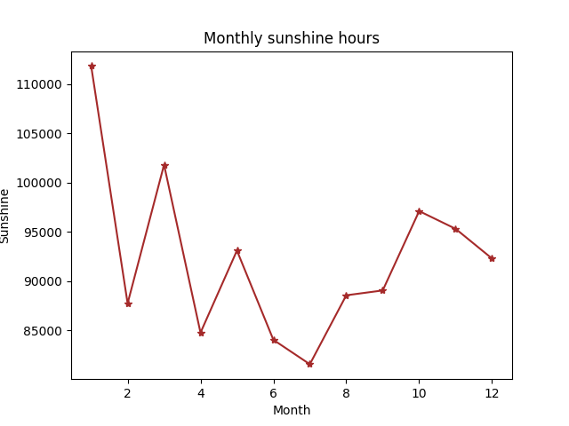
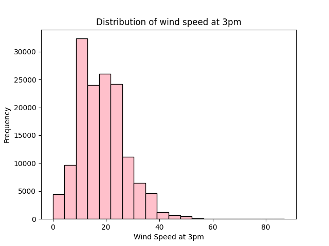
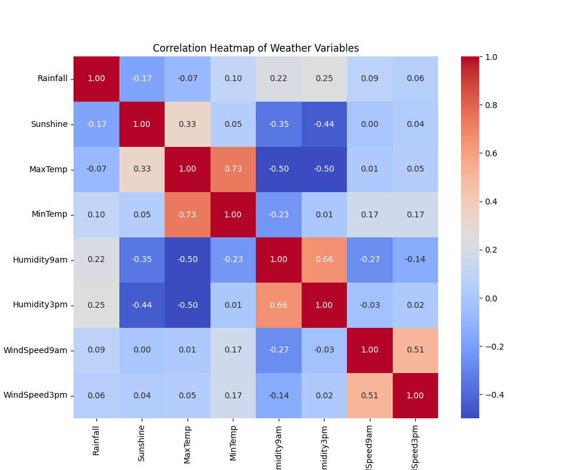
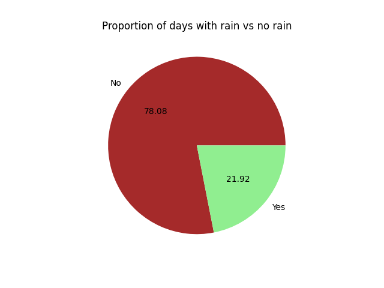

# 🌧️ Rainfall Prediction Dataset – WeatherAUS  

This project explores the **Rainfall Prediction Dataset** (Australia), performing **data cleaning, EDA, feature engineering, and predictive modeling**.  
The goal is to forecast whether it will rain **tomorrow** based on today’s weather conditions.  

---

## 📂 Dataset Overview  

- **Rows:** 145,460  
- **Columns:** 23  
- **Target Variable:** `RainTomorrow` (Yes/No)  

---

## 🔹 Data Cleaning  

- Converted categorical columns (`WindDir`, `RainToday`, `RainTomorrow`) → numeric.  
- Handled missing values in **Sunshine, Evaporation, Cloud**.  
- Normalized continuous variables like `Rainfall` and `WindSpeed`.  

---

## 🔹 EDA & Visualizations  

### 🌧️ Rainfall Distribution  
  

### 💧 Humidity vs RainTomorrow  
  

### 📍 Rainfall per Location  
  

### 💧 Overall Humidity Distribution  
  

### 📆 Yearly Rainfall Trend  
  

### 🌬️ Wind Direction Analysis  
  

### 🌞 Monthly Sunshine Trends  
  

### 🌬️ Wind Speed Distribution  
  

### 🔥 Correlation Heatmap  
  

### 🌧️ Proportion of Rainy Days  
  

---

## 🔹 Feature Engineering  

Created additional features for better modeling:  
- `Season` (from Date)  
- `Humidity_Diff` = Humidity9am – Humidity3pm  
- `Temp_Diff` = MaxTemp – MinTemp  
- `Rainfall_Category` (Low / Medium / High)  

---

## 🔹 Modeling  

- Logistic Regression (baseline)  
- Random Forest & XGBoost (best performers)  
- Class imbalance handled via **SMOTE** + class weights  

📌 **Result:** Random Forest achieved best recall and balanced accuracy.  

---

## 📌 Insights  

- 🌡️ Afternoon humidity is the **most important factor** for rainfall prediction.  
- 🌧️ If it rained today, it’s more likely to rain tomorrow.  
- 🌬️ Wind direction and strong gusts also impact rain probability.  
- ⚖️ Dataset is imbalanced (more “No Rain” days).  

---

## ✨ Conclusion  

- Weather variables contain **predictive signals** for rainfall forecasting.  
- **Feature engineering + tree-based models** improve accuracy.  
- Future scope: hyperparameter tuning, LSTM for time-series weather, deployment.  

---
